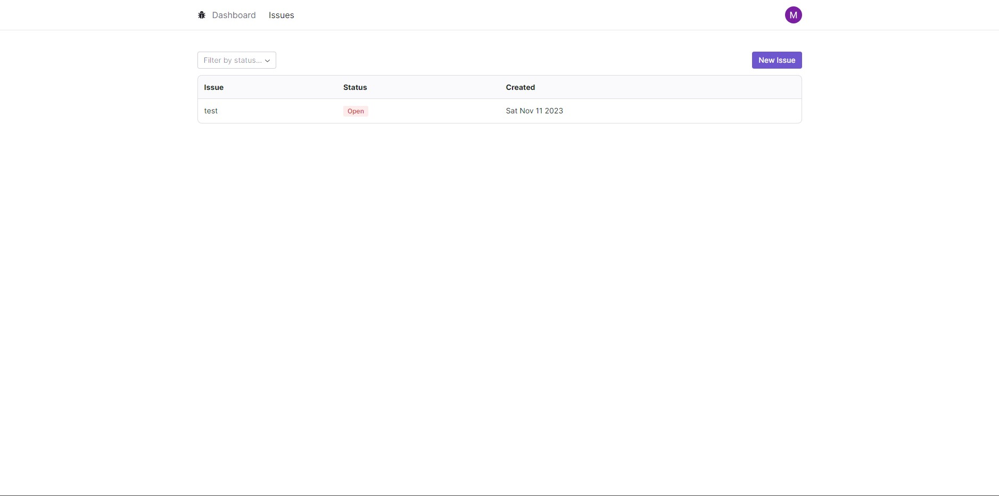
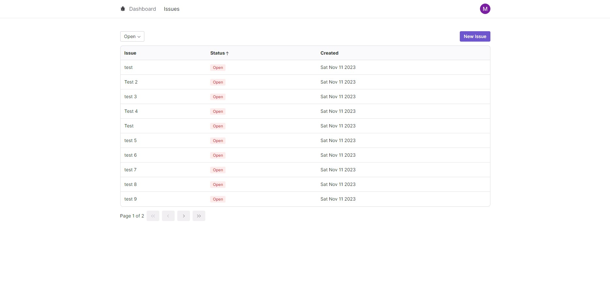
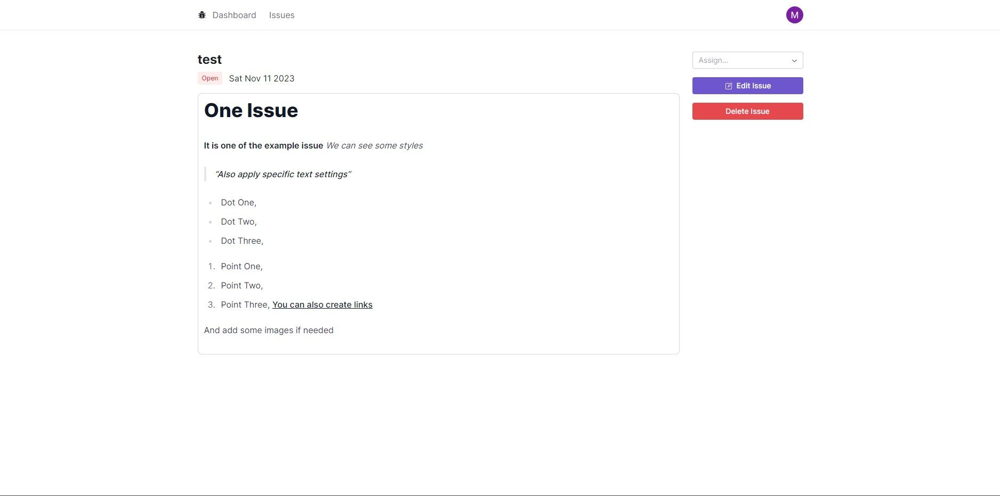
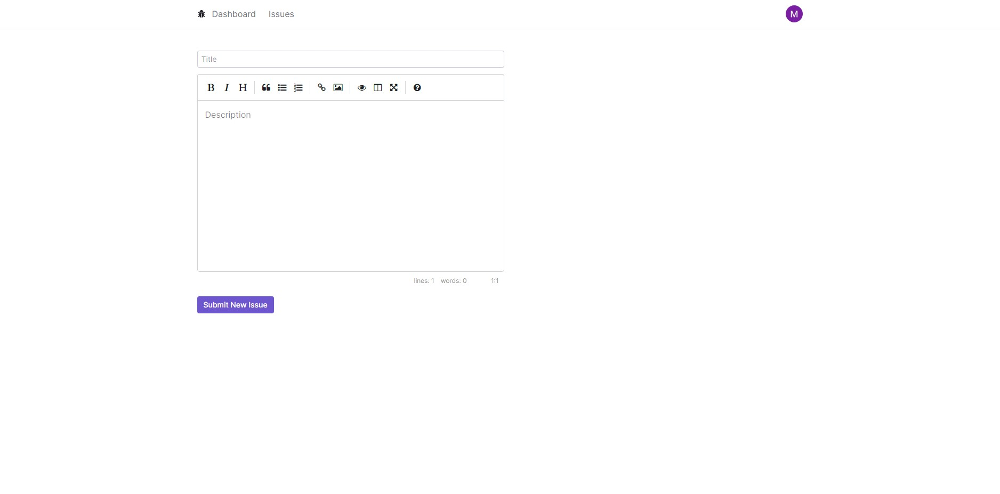
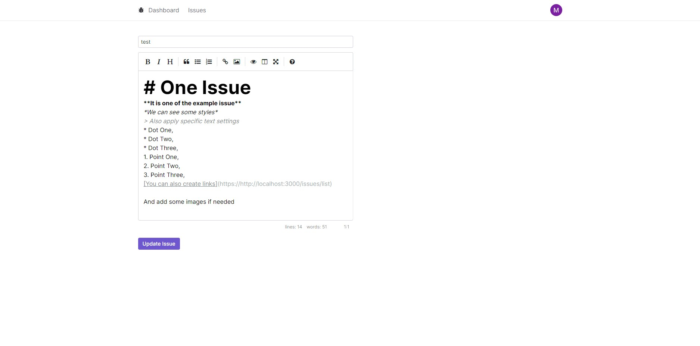
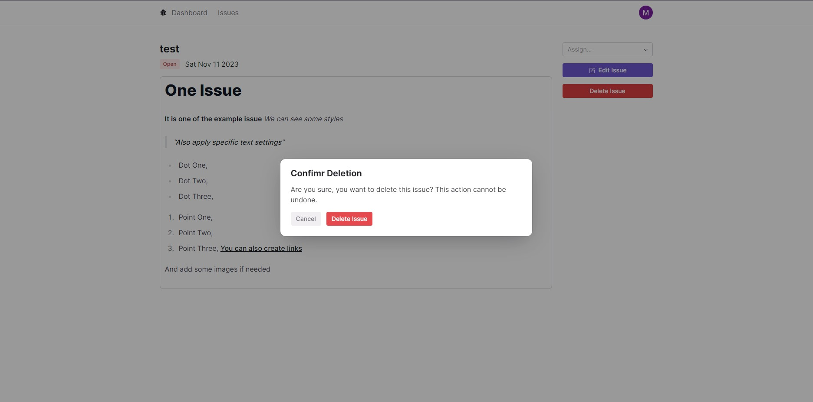

# Issue Tracker - Fullstack App

**Live Preview: Clone the project, set .exampleEnv like yours .env and run app for Yourself)**

Fully working Issue Tracking App. It is completed project created with Next.js and Tailwind. You can add, delete, edit Issue, watch how many is open, in progress or closed, and much more.

---

**NextJS 13, Tailwind and Prisma** made as a practice project. There is fullstack app, with CRUD. In this project I learned how to create modern UI, understand how is Tailwind working and Tailwind best practices. Also I learned new components library (RadixUI). Now I know how to use **Prisma** in real projects, add, edit and delete elements also with filtering by links and params. By this project I betterment also my JS and Next skills.   The page contains multiple views:
- Home page (Dashboard),
- LogIn and LogOut by google (OAuth 2.0),
- Issue Detail Page,
- Edit and Create Page,

---
# 🖥️ Pages

On this page you can see Chart with Issues to displaying the number of issues, boxes with numbers for easiest reading chart and latest issues into table. By clicking into box with status number you can go into IssuesPage with automatic filter for this specific Issue Status to see only one of them. Also when click into issue from Latest Issue list you can see all details.
 
 
 

Here we have full table with all of added issues -> we can use paginatiion, sorting, and clicking into rows to open detail page.
 
 
 

It is page with all details of our project. Also we have button to Edit or Delete Issue and dropdown with Assign option to one of all users from database.
 
 
 

Here we are creating our Issue. As You can see, we have form with two fields (One for title, and one text field with many text editing options - by react-simple-editor)
 
 
 

Similar page to createing issue, but with completed form and update button.
 
 
 

Confirmation of celete action in one of issues.

### What you can do?
- Login and logout when you are Gmail user,
- Add, edit and delete issue,
- Look at other people issues,
- Use sorting in table (sorting by title, status or created date),
- Use status filter to see only selected status,

### This app can be expanded:
- Status changing,
- Add other pages and links,
- Add descending sotring

## In project are used: 
- Reuseable components,
- Mapping,
- Better File and Folder structure for Next.js
- Responsive Web Design (RWD),
- Database,
- Pagination,
- Sorting,
- Filtering,
- SSR,
- NextAuth,
- JsonWebToken,

## Tools Used
1. JavaScript (NextJS 13 + TypeScript)
2. Prisma (Database)
3. Tailwind (Styles)
5. VSCode (Code Editor)
6. React Icons
7. RadixUI (Components)
8. React loading skeleton
9. Recharts
10. zod
11. NextAuth

 
 
 
## Just download and test it 😁
 
# Thanks for reading ^^ and nice to see You here
